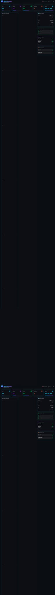

# OpenClaw UI 🖥️

A beautiful, real-time monitoring dashboard for OpenClaw Gateway.



## ✨ Features

- **Real-time Metrics** - CPU, Memory, Disk usage with live charts
- **Gateway Status** - Version, port, PID, uptime monitoring
- **Active Channels** - Connected messaging channels status
- **Skills & Agents** - Active skills monitoring
- **Cron Jobs** - Scheduled tasks overview
- **System Logs** - Terminal-style log viewer
- **Activity Timeline** - Recent events and actions

## 🎨 Design

- **Cyberpunk-inspired** dark theme
- **Glowing borders** and gradient accents
- **Real-time animations** and transitions
- **Responsive layout** for all screen sizes

## 🚀 Quick Start

```bash
# Clone the repository
git clone https://github.com/sherunlock03/openclaw-ui.git
cd openclaw-ui

# Install dependencies
npm install

# Start development server
npm run dev

# Build for production
npm run build
```

## 📦 Tech Stack

- **Vue 3** - Progressive JavaScript framework
- **Vite** - Next generation frontend tooling
- **Tailwind CSS** - Utility-first CSS framework
- **Chart.js** - Beautiful charts and graphs

## 🔧 Configuration

The dashboard connects to your OpenClaw Gateway. You can configure:

1. **Gateway URL** - Default: `ws://127.0.0.1:18789`
2. **Token** - Get from `openclaw dashboard --no-open`

## 📸 Screenshots

### Main Dashboard


### Features
- 📊 Real-time system metrics
- 📈 CPU & Memory charts
- 📋 System logs terminal
- 🕐 Activity timeline
- 🔌 Gateway status panel
- 💬 Active channels
- ⚡ Skills monitoring
- ⏰ Cron jobs overview

## 🤝 Contributing

Contributions are welcome! Feel free to submit issues and pull requests.

## 📄 License

MIT License - feel free to use this project for your own purposes.

---

Made with 💜 by OpenClaw Community